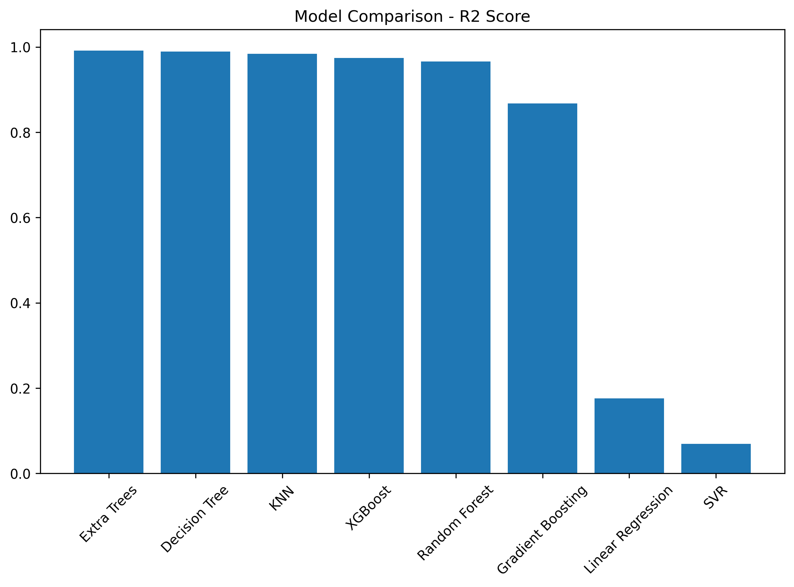
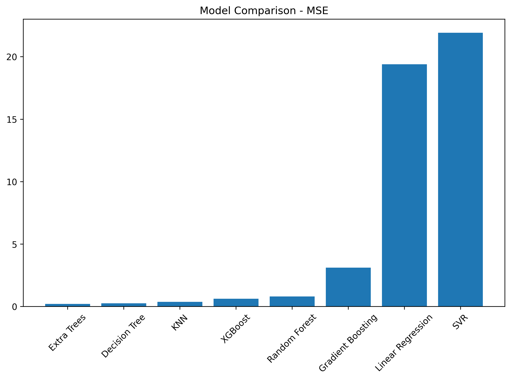
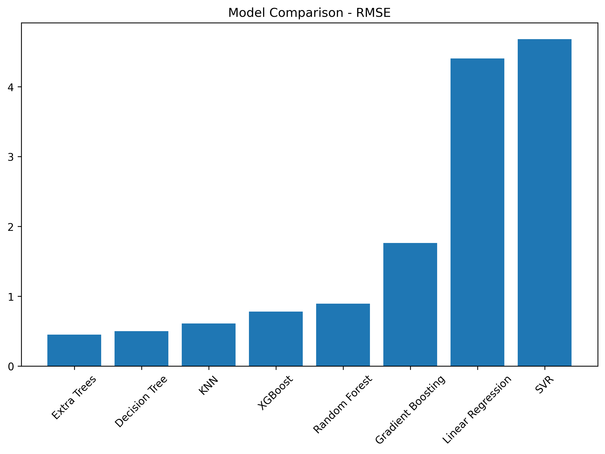
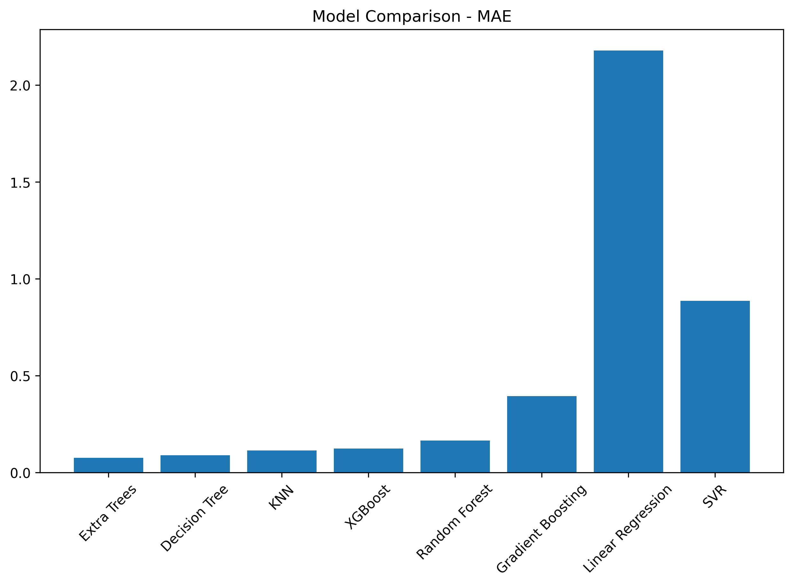

# Queuing-Simulation-and-Regression-Analysis-using-SimPy

## 1. Methodology

```
┌─────────────────────────────┐
│ Queuing System Simulation   │
│ (SimPy)                     │
└─────────┬───────────────────┘
          ↓
┌─────────────────────────────┐
│ Dataset Generation          │
│ (1000 Simulation Runs)      │
└─────────┬───────────────────┘
          ↓
┌─────────────────────────────┐
│ Train-Test Split            │
│ (80/20)                     │
└─────────┬───────────────────┘
          ↓
┌─────────────────────────────┐
│ Model Training              │
│ (8 Regression Models)       │
└─────────┬───────────────────┘
          ↓
┌─────────────────────────────┐
│ Model Evaluation            │
│ (R², MSE, RMSE, MAE)        │
└─────────┬───────────────────┘
          ↓
┌─────────────────────────────┐
│ Comparative Analysis        │
│ & Visualization             │
└─────────────────────────────┘
```

The methodology follows a sequential pipeline where a queuing system is simulated using **SimPy** to generate synthetic data. Multiple regression models are then trained and evaluated under identical conditions to predict the average waiting time of the system. Final model selection is based on comparative metric analysis.

## 2. Description

* **Task Type:** Regression (Predicting Average Waiting Time)
* **Simulation Framework:** SimPy
* **Simulation Parameters:**
  * Arrival Rate: Uniform(2, 10)
  * Service Rate: Uniform(5, 15)
  * Number of Servers: Randint(1, 5)
  * Simulation Time: 200
* **Number of Simulation Runs:** 1000
* **Train/Test Split:** 80/20
* **Random Seed:** 102316056
* **Execution Environment:** Google Colab (GPU enabled)

**Models Used:**

* Linear Regression
* Decision Tree Regressor
* Random Forest Regressor
* Gradient Boosting Regressor
* Extra Trees Regressor
* SVR (Support Vector Regressor)
* KNN (K-Nearest Neighbors Regressor)
* XGBoost Regressor

**Evaluation Metrics:**

* R² Score
* Mean Squared Error (MSE)
* Root Mean Squared Error (RMSE)
* Mean Absolute Error (MAE)

## 3. Input / Output

**Input**
* Three simulation parameters per run:
  * `arrival_rate` — rate at which patients arrive
  * `service_rate` — rate at which patients are served
  * `servers` — number of available servers

**Output**
* Predicted target variable:
  * `avg_waiting_time` — mean waiting time across all patients in a simulation run

**Model Comparison Output**
* Performance metrics for each of the 8 regression models
* Ranked list of models based on R² Score
* Bar chart visualizations for R², MSE, RMSE, and MAE

## 4. Results Summary

* **Highest R² Score** achieved by **Extra Trees** (0.9913)
* **Lowest MSE** achieved by **Extra Trees** (0.2038)
* **Lowest MAE** achieved by **Extra Trees** (0.0770)
* **Best overall model:** **Extra Trees Regressor**
  (due to superior performance across all evaluation metrics)

Tree-based ensemble methods (Extra Trees, Decision Tree, KNN, XGBoost, Random Forest) significantly outperform linear and kernel-based models (Linear Regression, SVR) for this non-linear queuing simulation task.

| Model | R² Score | MSE | RMSE | MAE |
| --- | --- | --- | --- | --- |
| **Extra Trees** | **0.9913** | **0.2038** | **0.4514** | **0.0770** |
| Decision Tree | 0.9894 | 0.2504 | 0.5004 | 0.0888 |
| KNN | 0.9841 | 0.3739 | 0.6115 | 0.1134 |
| XGBoost | 0.9740 | 0.6117 | 0.7821 | 0.1245 |
| Random Forest | 0.9661 | 0.7982 | 0.8934 | 0.1653 |
| Gradient Boosting | 0.8679 | 3.1086 | 1.7631 | 0.3946 |
| Linear Regression | 0.1759 | 19.3954 | 4.4040 | 2.1783 |
| SVR | 0.0689 | 21.9140 | 4.6812 | 0.8863 |

The Extra Trees Regressor achieves the highest R² Score and the lowest error across all metrics (MSE, RMSE, MAE). Linear Regression and SVR perform poorly owing to the inherently non-linear relationship between queuing parameters and waiting times. This demonstrates that for simulation-based regression tasks, tree-based ensemble models are significantly more suitable than simple linear or kernel-based approaches.

## 5. Visualizations

### R² Score Comparison


### MSE Comparison


### RMSE Comparison


### MAE Comparison


## 6. Conclusion

This project demonstrates the use of discrete-event simulation (SimPy) for generating queuing system data and the application of multiple regression models to predict average waiting times.

Key takeaways:
* **Extra Trees Regressor** is the best-performing model with an R² of 0.9913, indicating near-perfect prediction accuracy
* Tree-based ensemble methods consistently outperform linear and kernel-based models for this task
* **Linear Regression** and **SVR** fail to capture the non-linear dynamics of the queuing system, achieving R² scores below 0.18
* The simulation-based approach provides a controlled environment for benchmarking and comparing regression models under identical conditions
* Model performance depends heavily on the underlying data characteristics — non-linear relationships favor tree-based models over linear approaches
